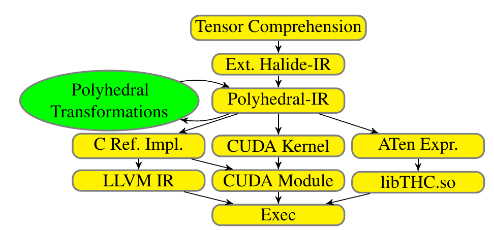
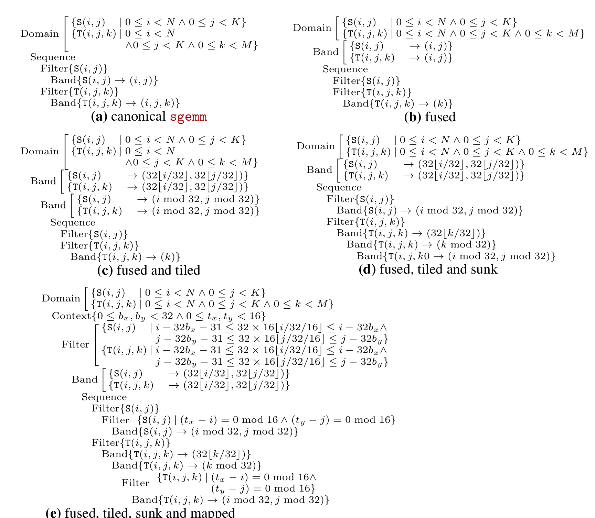
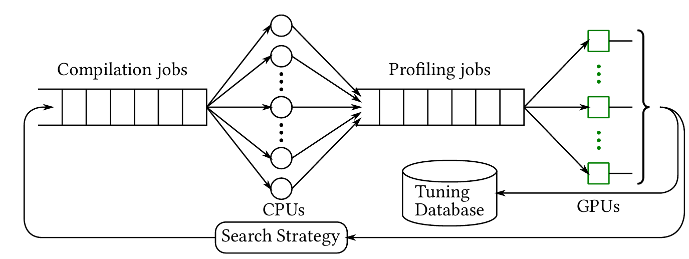
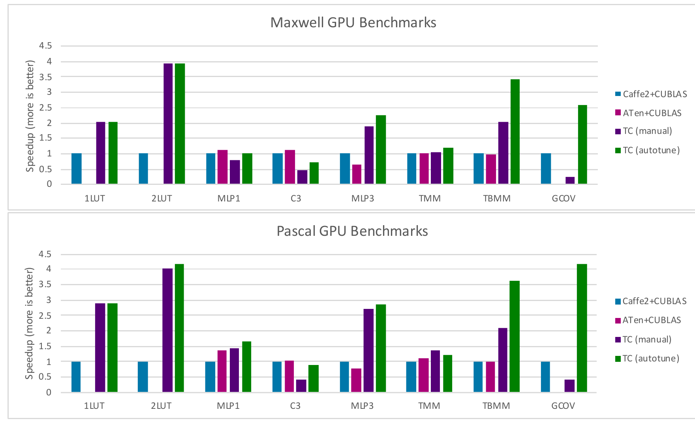

# Tensor Comprehensions 论文阅读报告

本文以 Nicolas Vasilache 等人的 2018 年论文 *Tensor Comprehensions: Framework-Agnostic High-Performance Machine Learning Abstractions*（下称 **TC 论文**）为主线，解释张量算子从数学定义到 GPU 内核的生成过程，以及自动调优在其中解决的问题。预备知识只需要矩阵乘法和基本循环；多面体编译、GPU 存储层次与性能测量在后文分别展开。文中的性能数字均来自论文报告，本文没有重新运行 TC 基准测试。[英文原文](https://arxiv.org/pdf/1802.04730)可在线阅读。

## 主要工作

TC 论文处理的是一个具体的工程问题：给定张量算子的数学计算规则和输入形状，自动生成适合目标 NVIDIA GPU 的 CUDA 内核，并通过实际运行时间选择实现。作者提供了三部分：表示张量计算的领域专用语言 Tensor Comprehensions、基于多面体表示的即时编译器，以及保存最快候选内核的自动调优与编译缓存。系统通过 ATen 张量库与当时的 PyTorch、Caffe2 集成；“框架无关”指 TC 的核心编译与运行接口可由不同框架适配，论文实现的代码生成目标仍是 CUDA。[TC 论文，摘要及 §1.2、§4、§6](https://arxiv.org/pdf/1802.04730)

核心流程可以写成：

```text
张量计算定义 + 输入形状/步幅 + 目标 GPU
       → 推断迭代范围与输出形状
       → 分析依赖，形成可变换的循环调度
       → 选择融合、分块、线程映射、存储位置
       → 生成并运行 CUDA 内核
       → 测量候选性能，缓存当前最优版本
```



*图 1：TC 的即时编译流程。截取自 [Vasilache 等，2018，原文图 2](https://arxiv.org/pdf/1802.04730#page=9)；图片中的左右分支表示参考实现与框架接口。*

“自动”有明确范围。TC 自动搜索同一计算定义的多种**实现方式**，例如块大小、线程数量和是否使用共享内存；它不搜索神经网络权重，也不改变算子要计算的数学函数。论文中的框架计算图到 TC 片段的匹配仍由人完成，跨整个网络的自动划分是作者留给后续工作的内容。[TC 论文，§4、§6](https://arxiv.org/pdf/1802.04730)

## 研究背景

深度学习框架通常把模型表示为由算子组成的有向无环图。矩阵乘法、卷积等节点可以调用 cuBLAS、cuDNN 一类高性能库。固定库函数难以覆盖研究中新出现的计算规则，也难以针对每一种形状、数据布局和相邻算子组合都给出最合适的内核。TC 论文将这一缺口表述为：既要保留便于描述新算子的高层抽象，又要自动决定 GPU 上的底层执行方式。[TC 论文，§1](https://arxiv.org/pdf/1802.04730)

在 TC 之前，**实测驱动的优化**与**计算和调度分离**已经各自形成了重要路线。ATLAS 为线性代数库生成多种候选实现，通过计时选择适合机器的版本；这一思路说明硬件性能可以作为搜索反馈。[ATLAS 论文，§I–III](https://icl.utk.edu/files/publications/2001/icl-utk-124-2001.pdf) Halide 则把图像处理的算法定义与执行调度分开：算法规定输出值，调度规定循环顺序、并行方式及中间数据何时计算和保存。[Halide 论文，§1–3](https://people.csail.mit.edu/jrk/halide-pldi13.pdf) TC 将两者用于机器学习算子，并让多面体编译器自动构造、变换部分调度，再以实测结果筛选候选。相对这些前序研究，论文的系统贡献是把张量语言、多面体 GPU 代码生成、形状专门化和缓存调优连成一条可供机器学习框架调用的流程。[TC 论文，§1–2](https://arxiv.org/pdf/1802.04730)

这里的**算子**是输入、输出及计算规则的组合，例如矩阵乘法；**内核**是该规则在 GPU 上的一份具体可执行实现。一个算子可以有多个正确内核。改变矩阵乘法的分块尺寸、线程映射或存储位置，计算目标保持为同一个矩阵，但运行时间可能不同。算子自动调优正是在这些候选内核中，针对给定形状和硬件寻找表现更好的版本。

## 问题定义

用矩阵乘法建立最小模型。给定形状分别为 M×K 和 K×N 的矩阵 A 与 B，目标是计算

```formula
C[i,j] = Σ(k=0,…,K−1) A[i,k] × B[k,j],  0 ≤ i < M,  0 ≤ j < N
```

公式确定了每个输出元素的值，却没有指定三个索引的循环次序、每个 GPU 线程负责多少元素、输入何时从全局内存加载。这些选择共同构成**调度与映射**。可行候选必须满足数据依赖、索引边界及 GPU 资源限制；在可行集合内，调优器用指定的测量指标比较运行时间。TC 的搜索维度包含融合策略、分块、CUDA 网格和线程块规模、展开程度、共享或私有存储使用等。[TC 论文，§5–6](https://arxiv.org/pdf/1802.04730)

因此，自动调优的完整对象并不只是一个“最佳块大小”，而是一个由计算定义、输入形状及步幅、目标硬件、候选生成规则、正确性条件、测量方法组成的优化问题。相同算子在不同形状或硬件上可能选出不同内核；选定版本要随这些条件一起缓存。[TC 论文，§6.1](https://arxiv.org/pdf/1802.04730)

## 方法原理

### 张量表达式与范围推断

TC 用接近爱因斯坦求和记号的形式写计算。以下是论文的矩阵向量乘法示意，其中 `i` 出现在输出下标中，`k` 只出现在右侧，因而成为归约索引：

```text
def mv(float(M,K) A, float(K) x) -> (C) {
  C(i) +=! A(i,k) * x(k)
}
```

在一个 TC 语句中，左侧（LHS）指定写入哪个输出张量元素，右侧（RHS）指定计算所需的输入及运算。索引变量通过使用而引入，其取值范围由所索引的张量形状推断，无法唯一推断时需要 `where` 显式约束。出现在 LHS 的索引确定输出位置；只出现在 RHS 的索引成为归约维度。例如上例的 `i` 对应不同输出元素，`k` 遍历乘积并按加法合并。若 LHS 的某个索引未出现在 RHS，相同的 RHS 值会沿该输出维度广播，前提是该索引的范围已由其他语句或约束确定。[TC 论文，§3–3.1](https://arxiv.org/pdf/1802.04730)

归约操作要使用可交换、可结合的合并规则，使编译器能够改变迭代顺序。`C(i) += ...` 会累加到已有的 `C(i)`；`+=!` 是先以加法单位元初始化、再归约的简写。TC 的语义还要求同一语句先完整读取 RHS，再写入 LHS，因此原地更新须通过依赖检查。浮点归约重排的数值差异见“局限性”。[TC 论文，§3](https://arxiv.org/pdf/1802.04730)

上例对每个 i，将所有 k 对应的 A[i,k]×x[k] 求和。TC 根据输入形状推得 0 ≤ i < M、0 ≤ k < K，编译器随后可选择不同循环和并行布局。[TC 论文，§3](https://arxiv.org/pdf/1802.04730)

索引范围并非总能从一个式子唯一推断。对于一维有效卷积 `O(i) +=! I(i+x) * K(x)`，若输入长度为 M、卷积核长度为 N 且 M ≥ N，TC 先由 `K(x)` 推得 0 ≤ x < N，再要求所有这些 `x` 对给定 `i` 均不越界，于是 0 ≤ i ≤ M−N，输出长度为 M−N+1。若某个索引缺少足够约束，例如池化窗口的局部索引，程序需要 `where` 显式指定范围。该过程解释了高层表达式如何成为有确定边界的循环。[TC 论文，§3.1](https://arxiv.org/pdf/1802.04730)

表达式还可覆盖多个相邻操作。矩阵乘法后紧接偏置和 ReLU 时，若输出尚未被其他算子消费，中间结果可以在同一内核中继续处理，减少中间张量读写与内核启动。TC 允许用户把这样的计算写为一个片段；论文并未实现从任意框架计算图中自动选出最佳融合片段。[TC 论文，§3、§4](https://arxiv.org/pdf/1802.04730)

### 多面体调度与 GPU 映射

TC 编译流程先把表达式降到 Halide 中间表示，再转入多面体表示。中间表示（intermediate representation，IR）是编译器处理程序的内部形式；这里逐级降低抽象层次，让数学式最终成为可生成循环与 CUDA 代码的结构。TC 使用 isl（integer set library）处理整数集合、关系和调度，早期原型曾利用 PPCG（Polyhedral Parallel Code Generator）的 GPU 代码生成能力；论文所述公开实现后来重写了所需部分。多面体模型用整数点集合表示每一次语句执行，用**访问关系**表示执行实例读写哪个张量元素，用**依赖关系**限定合法执行先后，最后用**调度**规定实例的顺序。编译器在保持依赖的前提下改变调度，并生成相应循环。[TC 论文，图 2、§5、附录 A.3](https://arxiv.org/pdf/1802.04730)

以矩阵乘法为例，对不同 (i,j) 的输出元素可以并行计算；同一 (i,j) 沿 k 的累加则需要遵守归约规则。编译器可以把外层 (i,j) 划成二维块，让一个 CUDA 线程块负责一个输出区域，并把块内输出映射给多个线程。沿 k 的输入块可搬到共享内存，供线程重复使用。**分块**决定一次处理多大的计算区域，**线程映射**决定区域内谁处理哪些元素，**存储提升**决定重复使用的数据放在何处；三个决定相互影响。[TC 论文，§5.3–5.5](https://arxiv.org/pdf/1802.04730) [CUDA 编程模型](https://docs.nvidia.com/cuda/cuda-programming-guide/01-introduction/programming-model.html)

论文使用 **schedule tree（调度树）**保存多层顺序和分支。其 `band` 节点表示可进一步分块或映射的循环维度，`sequence` 节点约束语句先后，`filter` 节点选取适用的迭代实例。论文图 3 从初始化和累加两个语句出发，依次展示融合、分块、循环下沉和 GPU 线程映射。调度树之所以有用，是因为它保留了这种层次结构，并能在树上局部实施变换。[Schedule Trees 论文，§1–2](https://acohen.gitlabpages.inria.fr/impact/impact2014/papers/impact2014-verdoolaege.pdf) [TC 论文，图 3、§5](https://arxiv.org/pdf/1802.04730)



*图 2：矩阵乘调度树的五步变换，依次为原始调度、融合、分块、循环下沉与 GPU 映射。截取自 [Vasilache 等，2018，原文图 3](https://arxiv.org/pdf/1802.04730#page=11)。*

对于 `X(Idx(i))` 这类间接访问，索引值在编译时未知。TC 的多面体分析仍可处理其可确定的外围迭代范围，并在只读等条件下，把索引及实际访问值分阶段装入共享内存。它不能把任意数据依赖的索引变成普通仿射下标；这也是计算定义、静态分析和运行时加载各自承担不同任务的例子。[TC 论文，§5.5](https://arxiv.org/pdf/1802.04730)

### 自动调优与编译缓存

多面体分析负责产生合法候选及部分启发式调度，运行时间仍要通过实测判断。TC 的调优器从已有配置和预设策略出发，给调优参数设定取值范围；实现中可采用随机搜索或遗传算法。遗传算法把一组参数看作一个候选：编译、计时、按运行时间赋予适应度，再用多亲本交叉和低概率变异生成下一批候选。CPU 并行编译，GPU 测量，较优结果进入持久化缓存。[TC 论文，§6.2、图 4](https://arxiv.org/pdf/1802.04730)



*图 3：TC 的并行调优流程。截取自 [Vasilache 等，2018，原文图 4](https://arxiv.org/pdf/1802.04730#page=16)。*

**即时编译（JIT）**表示在获得实际输入条件后生成所需内核。TC 会利用已知形状专门化循环和索引计算；后续相同条件可直接取缓存中的版本。缓存键覆盖计算定义、输入形状和目标架构等条件，缓存保存当前最快的代码与相关信息。由于专门化会增加候选数，调优耗时、编译耗时及缓存空间也属于系统成本。[TC 论文，§6.1](https://arxiv.org/pdf/1802.04730)

## 实验与证据

论文在 Tesla M40（Maxwell）与 Tesla P100（Pascal）上比较 TC、Caffe2 和 ATen。报告使用 CUDA 8、cuBLAS 8、cuDNN 6；每组运行 1000 次，表 5–6 给出最小值、**p50（中位数）**和 p90。作者说明所报时间包含 CPU 调用开销和 `cudaDeviceSynchronize`，并用参考实现检查输出；这不是单独测得的 GPU 内核执行时间。一次完整遗传调优使用 100 个候选、25 代、16 个 CPU 线程和 8 张 GPU，约耗费 6 小时。[TC 论文，§7、图 5–6](https://arxiv.org/pdf/1802.04730)

下表只摘取论文 P100 的 p50 数据；“相对速度”用同一行基线时间除以 TC 时间计算。不同工作负载的绝对时间不应直接比较。

| 工作负载与论文设置 | Caffe2 基线 | TC 自动调优 | 相对速度 | 对应证据 |
| --- | ---: | ---: | ---: | --- |
| 转置矩阵乘，M=128, K=32, N=256 | 30 µs | 25 µs | 1.20× | 图 5 |
| 转置矩阵乘，M=128, K=4096, N=16384 | 2431 µs | 8177 µs | 0.30× | 图 5 |
| 批量转置矩阵乘，B=500, M=72, K=26, N=26 | 192 µs | 53 µs | 3.62× | 图 5 |
| 分组卷积，表中形状 (32,32,4,4,56,56) | 4106 µs | 481 µs | 8.54× | 图 5 |
| 双查表 `2LUT` | 125 µs | 30 µs | 4.17× | 图 6 |
| 三层融合 MLP `MLP3` | 131 µs | 46 µs | 2.85× | 图 6 |



*图 4：论文所选最小配置的 p50 相对速度，以 Caffe2 基线归一化；它的配置范围与上表逐项摘录的 P100 数据不同。截取自 [Vasilache 等，2018，原文图 7](https://arxiv.org/pdf/1802.04730#page=19)。*

这些数据表明收益依赖于算子和尺寸。较小的批量矩阵乘、分组卷积、查表及多层融合为 TC 提供了降低启动开销、利用形状或跨算子优化的机会；大型转置矩阵乘则明显落后于 cuBLAS。作者把后者与当时尚未实现的深度寄存器分块、共享内存带宽限制和高度手工优化的库内核联系起来。表内数字支持“某些指定配置更快”，不构成对所有矩阵乘或所有 GPU 的通用结论。[TC 论文，§5.6–7、图 5–6](https://arxiv.org/pdf/1802.04730)

## 局限性

TC 把框架内存管理与张量对象留给宿主环境，但本文实现主要面向 NVIDIA CUDA；图到 TC 片段的划分仍需人工决定。数据布局变换主要在 TC 源级由领域专家表达，复杂寄存器级优化与一些归约策略也未完成。这些边界直接影响大型矩阵乘和更广泛硬件上的性能。[TC 论文，§3.2、§4、§5.6、§8](https://arxiv.org/pdf/1802.04730)

自动调优结果还受**搜索预算和计时范围**约束。有限时间内找到的是已试候选中的较快版本，不是全体可能实现的数学最优解。论文一次完整搜索约 6 小时，因此上线时需要考虑离线调优、缓存复用和形状变化的频率。对于只调用几次的算子，可用 T_total = T_tune + T_compile + n × T_run 粗略检查调优成本能否摊销；这个式子是本文的成本分析，不是论文的实验公式。[TC 论文，§6–7](https://arxiv.org/pdf/1802.04730)

TC 论文把归约算子按交换与结合性质处理，以便重排执行。实际浮点加法会受舍入影响，改变归约顺序可能改变末位结果；比较候选时应采用与应用相符的误差容限。论文检查了与参考实现的输出，但未在上述表格中系统给出不同调度的数值误差分布。[TC 论文，§3、§7](https://arxiv.org/pdf/1802.04730) [NVIDIA 浮点计算与正确性说明](https://docs.nvidia.com/cuda/cuda-c-best-practices-guide/index.html#floating-point-math-is-not-associative)

## 结论

TC 的贡献在于把“定义算子”和“决定如何在 GPU 上执行”连接为可编译、可搜索的流程。读者理解这篇论文的关键，是把四种对象分开：张量表达式确定结果，依赖分析约束合法变换，调度与映射产生不同内核，实测调优按目标硬件和输入条件选取版本。论文实验同时给出了适合 TC 的融合与特殊形状案例，以及大型矩阵乘上的性能缺口。因而，算子自动调优是一套受搜索空间、硬件资源、测量方法和复用次数共同约束的系统方法。

## 附录 A：张量计算与算子融合

**张量**是带形状和数据布局的多维数组。形状 (M,K) 说明两个维度的元素数；布局还要说明相邻元素如何放在内存中，例如每个维度的步幅。相同数学数组若步幅不同，连续线程访问内存的模式也可能不同，所以 TC 编译缓存把相关输入信息纳入条件。[TC 论文，§3.2、§6.1](https://arxiv.org/pdf/1802.04730)

**归约**把一个索引维度上的多个值合成一个输出值。矩阵乘法中的 k 是归约维；(i,j) 是输出维。并行输出维通常较直接，因为不同输出位置相互独立；并行归约维需要组织局部累加及合并。因此，同一个公式蕴含不同的并行机会。

**算子融合**把若干相邻操作放进一个内核。例如 `matmul → bias → ReLU` 若分别生成内核，至少要存取中间张量并启动多个内核；融合后，偏置和激活可在生产矩阵结果的流程中执行。融合是否有利仍取决于中间值大小、所需同步、寄存器及共享内存占用。Halide 的调度研究揭示了数据局部性、并行性与重复计算之间的权衡，TC 则把融合策略纳入 GPU 调度及调优。[Halide 论文，§1–3](https://people.csail.mit.edu/jrk/halide-pldi13.pdf) [TC 论文，§5–6](https://arxiv.org/pdf/1802.04730)

## 附录 B：多面体模型的最小推导

以下推导用于理解 TC 的图 3，采用前文定义的普通矩阵乘法；它是本文的教学例子，不是 TC 生成代码的逐行还原。

把 `C[i,j]=0` 记为语句 S，把 `C[i,j]+=A[i,k]*B[k,j]` 记为语句 T。两类执行实例的**迭代域**为

```formula
D_S = {(i,j) | 0 ≤ i < M, 0 ≤ j < N}
D_T = {(i,j,k) | 0 ≤ i < M, 0 ≤ j < N, 0 ≤ k < K}
```

`T(i,j,k)` 的读访问包括 `A(i,k)`、`B(k,j)` 与累加器 `C(i,j)`，写访问是 `C(i,j)`。同一个 (i,j) 必须先初始化，再完成其归约；不同 (i,j) 可作为并行工作。**调度**是将执行实例映射到逻辑执行次序的函数。先完成全部初始化再计算全部累加是一种调度；在每个输出元素内部紧接初始化进行归约，是另一种合法调度。后一种把相同输出的数据访问靠得更近，即论文图 3 的融合思路。[TC 论文，§5、附录 A.3](https://arxiv.org/pdf/1802.04730)

若把输出按 32×32 分块，外层块索引可写为 (⌊i/32⌋, ⌊j/32⌋)，块内索引为 (i mod 32, j mod 32)。不同输出块可映射到不同 CUDA 线程块；每块内部再分配给线程。合法性来自依赖关系，性能则要评估数据复用、全局内存访问、共享内存占用和启动配置。多面体模型的价值，是让循环重排、融合、分块与映射建立在同一套实例和依赖表示上。[Schedule Trees 论文，§2](https://acohen.gitlabpages.inria.fr/impact/impact2014/papers/impact2014-verdoolaege.pdf) [TC 论文，§5](https://arxiv.org/pdf/1802.04730)

**仿射访问**指下标由索引和参数的线性组合加常数构成，例如 `A(i,k)`、`I(i+x)`。这类访问容易用整数约束表达。`X(Idx(i))` 的实际地址取决于数据值；TC 对其外围可确定部分进行分析，并用专门的间接访问存储提升处理部分情况。由此可见，多面体编译在本文是一个适合大量规则循环的优化框架，而算子定义中存在间接访问时还需要补充机制。[TC 论文，§3、§5.5](https://arxiv.org/pdf/1802.04730)

## 附录 C：GPU 性能概念与测量边界

一个 CUDA 内核以 **grid（网格）** 启动；网格包含多个 **block（线程块）**；线程块内包含多个线程。属于同一块的线程能通过共享内存交换数据并同步。线程执行时又按 warp 分组。将输出块分给 CUDA block、将块内元素分给线程，是 TC 的“映射”；如何安排 k 循环和中间数据，则是调度与存储选择。[CUDA 编程模型](https://docs.nvidia.com/cuda/cuda-programming-guide/01-introduction/programming-model.html)

GPU **全局内存**容量较大；**共享内存**由同一线程块使用；**寄存器**主要保存线程的局部值。把重复使用的输入块从全局内存装入共享内存，可减少重复加载；若每块使用过多共享内存或每线程使用过多寄存器，同一计算单元可同时驻留的块或 warp 数可能下降。这个资源约束解释了为何扩大分块并不保证更快，也解释了 TC 要同时搜索分块与存储配置。[CUDA Programming Guide，线程块资源](https://docs.nvidia.com/cuda/cuda-programming-guide/03-advanced/advanced-kernel-programming.html) [TC 论文，§5.5、§6.2](https://arxiv.org/pdf/1802.04730)

**访存合并**关注相近线程访问的全局地址能否由较少的内存事务服务；连续、对齐的数据布局通常有利于这一点。**占用率**是一个 SM 上活跃 warp 数占其可支持上限的比例，体现隐藏延迟的能力，但单独最大化占用率并不等于最大化速度。TC 论文依据访问模式和复用决定部分共享内存提升，又把资源配置留给调优器筛选。[CUDA 最佳实践：访存与占用率](https://docs.nvidia.com/cuda/cuda-c-best-practices-guide/index.html) [TC 论文，§5.5、§6.2](https://arxiv.org/pdf/1802.04730)

**Roofline 模型**用运算强度 I（浮点运算次数除以传输字节数）连接算力和带宽，其简化上界为 P ≤ min(P_peak, B_peak × I)。它帮助判断候选实现更受算力或数据搬运限制。改变分块与数据复用会改变实际传输量；融合还可能减少中间数据流量。但小内核的启动开销、同步和编译缓存命中情况不直接由这条上界描述，因此论文保留了整条调用路径的测量。[Roofline 原论文，§3](https://people.eecs.berkeley.edu/~kubitron/courses/cs252/handouts/papers/RooflineVyNoYellow.pdf) [TC 论文，§7](https://arxiv.org/pdf/1802.04730)

比较自动调优系统时至少应固定：硬件与软件版本、输入形状及布局、精度与误差标准、预热及重复次数、计时区间、搜索预算、基线选择。TC 图 5–6 的 `µs` 包含 CPU 同步调用；若改为仅测 GPU 内核时间，其数值和相对差异都可能变化。[TC 论文，§7](https://arxiv.org/pdf/1802.04730) [CUDA 最佳实践：计时](https://docs.nvidia.com/cuda/cuda-c-best-practices-guide/index.html#timing)

## 附录 D：相关研究与继续阅读

以下论文沿着本文中出现的概念依赖排列，而不是按声称的性能高低排序。表中“与 TC 的关系”是本文对各论文研究问题的归纳。

| 阅读顺序 | 论文及本地文件 | 重点 | 与 TC 的关系 |
| --- | --- | --- | --- |
| 1 | [ATLAS，2001](https://icl.utk.edu/files/publications/2001/icl-utk-124-2001.pdf) | 为同一线性代数函数生成多个实现，以实测选择机器适配版本 | 建立经验式自动调优的基本模型 |
| 2 | [Halide，2013](https://people.csail.mit.edu/jrk/halide-pldi13.pdf) | 分离算法定义和执行调度，分析融合、局部性与重复计算 | 解释 TC 为何需要保留数学定义而单独搜索执行方式 |
| 3 | [Schedule Trees，2014](https://acohen.gitlabpages.inria.fr/impact/impact2014/papers/impact2014-verdoolaege.pdf) | 用显式树表示多面体调度的层次、顺序和过滤 | 帮助理解 TC 图 3 的树节点及变换 |
| 4 | [OpenTuner，2014](https://commit.csail.mit.edu/papers/2014/ansel-pact14-opentuner.pdf) | 比较搜索算法，并依据已得到的结果动态分配尝试预算 | 帮助理解搜索策略本身也是自动调优设计的一部分 |
| 5 | [TC，2018](https://arxiv.org/pdf/1802.04730) | 张量语言、多面体 GPU 编译、遗传调优和缓存 | 本文主线 |
| 6 | [TVM，2018](https://www.usenix.org/system/files/osdi18-chen.pdf) 与 [Learning to Optimize Tensor Programs，2018](https://papers.neurips.cc/paper/7599-learning-to-optimize-tensor-programs.pdf) | 图与算子优化、模板调度、学习型代价模型 | 对比另一种候选生成与搜索反馈组织方式 |
| 7 | [Triton，2019](https://www.eecs.harvard.edu/~htk/publication/2019-mapl-tillet-kung-cox.pdf) | 以显式 tile 变量和 tile 级编译组织 GPU 内核 | 观察更靠近 GPU 内核编程层的抽象 |
| 8 | [Ansor，2020](https://www.usenix.org/system/files/osdi20-zheng.pdf) | 自动生成层次化搜索空间，用演化搜索和学习型代价模型筛选程序 | 观察搜索空间构造与多子图调优的后续发展 |

TVM 论文以图级优化、算子级调度与多硬件后端为系统目标；其学习型代价模型用于减少昂贵的真实测量。Ansor 进一步把高层程序结构称为 *sketch*，自动生成结构并采样低层参数，再用演化搜索和代价模型优化完整程序。Triton 则把 tile 作为程序中的显式对象，编译器围绕 tile 级操作优化。这些路线共享“计算定义—候选实现—性能反馈”的问题，但输入语言、候选空间与自动化边界不同。[TVM 论文，§1、§5](https://www.usenix.org/system/files/osdi18-chen.pdf) [Ansor 论文，§1、§3–5](https://www.usenix.org/system/files/osdi20-zheng.pdf) [Triton 论文，§1–2](https://www.eecs.harvard.edu/~htk/publication/2019-mapl-tillet-kung-cox.pdf)

原文例子宜以计算规则为准，而不宜机械复制每一行。TC 论文的 `fcrelu` 示例把偏置声明为长度 `I`，随后却按输出维度 `j` 索引；分组卷积示例的 `B(m)` 中 `m` 未定义。这两处索引与声明不一致。理解机制时，应以相应张量维度核对下标，再写自己的最小示例。[TC 论文，§3、§7](https://arxiv.org/pdf/1802.04730)
